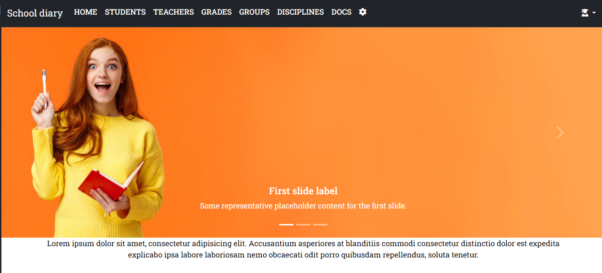
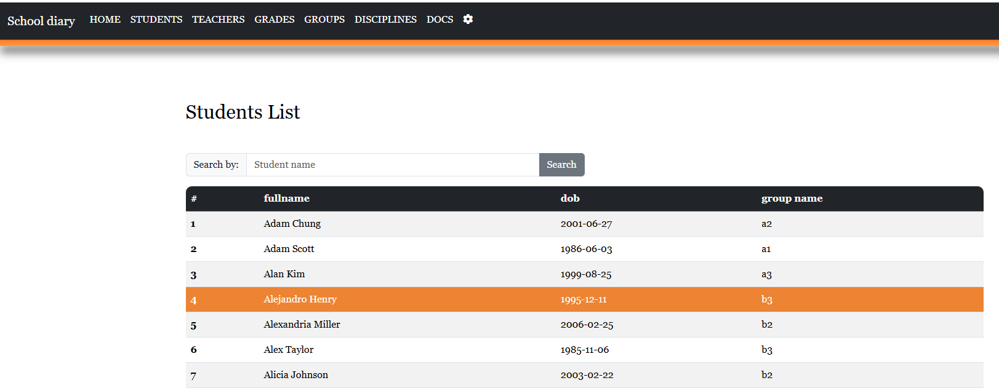
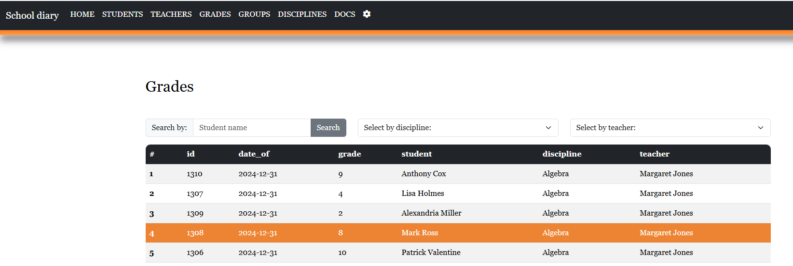
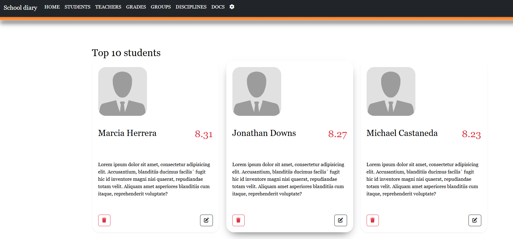

# School diary app (FastAPI)

---
### Features
- CRUD methods implemented for all entities.
- Data rendering using Jinja templates.
- Editing and searching of information.
- Caching user and student data requests using Redis.
- OAuth2 authentication.
- PostgreSQL used for data storage.
- Auto-generation of fake data for testing.
- Documentation written using Sphinx.
- Tests written using Pytest.

### Structure
<b>Note: Some features steel in progress</b>
- Students
- Teachers
- Grades
- Groups
- Disciplines
- Docs
- Seed
- Sign in /log in

### Screenshots
Please see above

### Credits
Developed by Vitaliy Lobko. 
If You have any proposiotions, you can contact with me:

